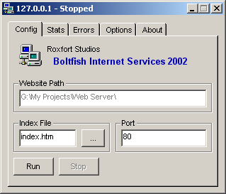



## Web Server \(BIS\) 1\.0

### Description

Another Web Server...so you can host files on your computer and let others access them directly; supports images, zip, html, etc. Runs in the system tray. Your settings are saved in an ini file. It has ../ protection and custom error pages. Please give me some feedback on this one.
 
### More Info
 

             |
---                |---
**Submitted On**   |2002-12-14 17:12:36
**By**             |[boltfishy](https://github.com/Planet-Source-Code/PSCIndex/blob/master/ByAuthor/boltfishy.md)
**Level**          |Intermediate
**User Rating**    |4.8 (19 globes from 4 users)
**Compatibility**  |VB 6\.0
**Category**       |[Internet/ HTML](https://github.com/Planet-Source-Code/PSCIndex/blob/master/ByCategory/internet-html__1-34.md)
**World**          |[Visual Basic](https://github.com/Planet-Source-Code/PSCIndex/blob/master/ByWorld/visual-basic.md)
**Archive File**   |[Web\_Server15143812162002\.zip](https://github.com/Planet-Source-Code/boltfishy-web-server-bis-1-0__1-41637/archive/master.zip)

